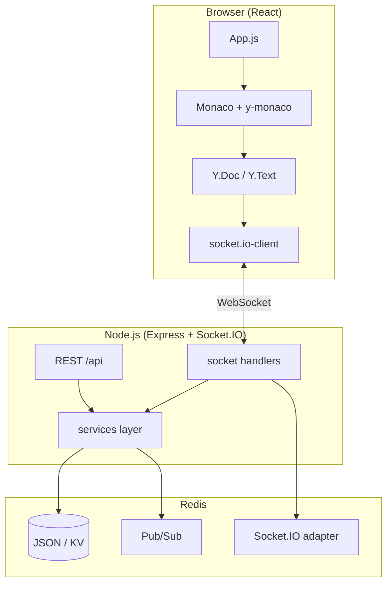

# DevWeave

**Real-time collaborative code editor** — multiple developers edit the same document with conflict-free merges (Yjs CRDT), live cursors, presence, chat, and in-browser JavaScript execution.

---

## Features

- **CRDT sync** — Yjs + `y-monaco` for reliable multi-user editing
- **Realtime** — Socket.IO for document, cursor, and chat events
- **Scale-out ready** — Redis adapter for multi-instance Socket.IO
- **Monaco Editor** — syntax highlighting, themes, in-browser JS execution
- **Collaboration** — live cursors, presence, room chat, shareable document URLs

---

## Architecture



---

## Tech stack

| Layer | Technologies |
|-------|----------------|
| Frontend | React, Monaco Editor, Yjs, y-monaco, Tailwind CSS, Socket.IO client |
| Backend | Node.js, Express, Socket.IO, Joi, VM2 (sandboxed JS execution) |
| Data | Redis (storage, Pub/Sub, Socket.IO adapter) |

---

## Project structure

```
├── backend/
│   ├── server.js
│   ├── routes/api.js
│   ├── sockets/
│   ├── services/
│   └── redis/
└── frontend/
    └── src/
        ├── App.js
        ├── components/
        └── services/
```

---

## Quick start

### Prerequisites

- Node.js 16+
- Redis (local or cloud)

### Install

```bash
git clone https://github.com/sahuhasrh/devweave.git
cd devweave
npm run install:all
```

### Environment

```bash
cp .env.example backend/.env
```

Edit `backend/.env`:

```env
REDIS_HOST=localhost
REDIS_PORT=6379
REDIS_TLS=false
PORT=5002
CLIENT_URL=http://localhost:3000
```

### Run

```bash
# Terminal 1
npm run dev:backend

# Terminal 2
npm run dev:frontend
```

Open [http://localhost:3000](http://localhost:3000) and share the URL (`?doc=<id>`) to collaborate.

---

## API

| Endpoint | Purpose |
|----------|---------|
| `GET /api/health` | Health check / Redis connectivity |

See `backend/routes/api.js` for document, chat, and code execution routes.

---

## License

[MIT](./LICENSE)
